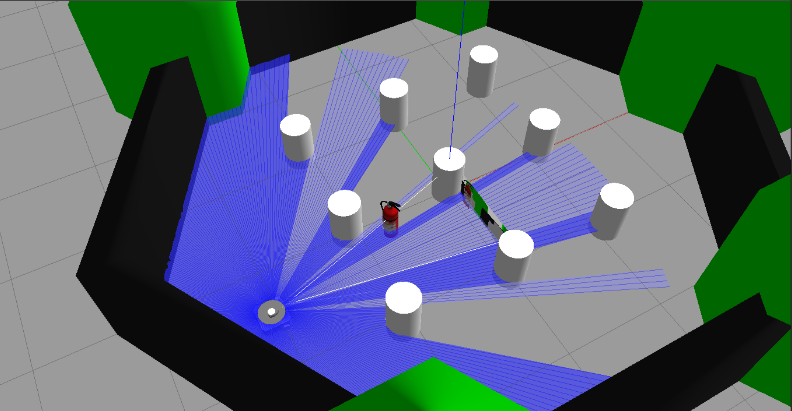
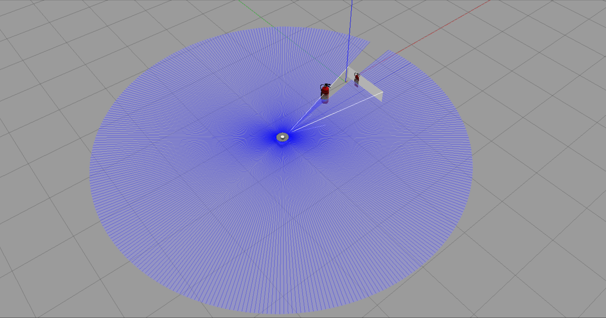

# mk_0_gazebo

KHU robotics club Hyper's summer project.

Gazebo 시뮬레이션에서 사용되는 월드, 로봇 모델을 수정해서 사용하기 위한 리포지토리입니다.

[turtlebot3_gazebo 패키지](https://github.com/ROBOTIS-GIT/turtlebot3_simulations)를 수정하여 만들어졌습니다.

## 사용 방법

1. `<워크스페이스>/src/` 아래에 리포지토리를 clone.
    
    ```bash
    $ cd <workspace>/src
    $ git clone <https://github.com/kodogyu/mk_0_gazebo.git>
    ```
    
2. `sohwagi` 모델을 이동

    ```bash
    $ cp -r src/mk_0_gazebo_models/sohwagi ~/.gazebo/models
    ```

2. `<워크스페이스>`에서 빌드.
    
    ```bash
    $ cd ../
    $ colcon build
    ```
    
3. 워크스페이스의 `setup.bash` 파일 실행.
    
    ```bash
    $ source <workspace>/install/setup.bash
    ```
    
4. **TURTLEBOT3_MODEL** 환경변수를 **waffle_mk0**로 선언해야 합니다.
    
    ```xml
    $ export TURTLEBOT3_MODEL=waffle_mk0
    ```
    
5. 이제 `mk_0_gazebo` 패키지를 사용할 수 있습니다.
    
    ```bash
    $ ros2 launch mk_0_gazebo hyper_world.launch.py
    ```
    

### 기본 월드 파일

hyper_world


empty_world


### 월드 파일 수정

`mk_0_gazebo/worlds/hyper_worlds/waffle_mk0.model` 파일을 수정합니다.

### 모델 파일 수정

- `mk_0_gazebo/models/turtlebot3_waffle_mk0/model.sdf`
- `mk_0_gazebo/urdf/turtlebot3_waffle_mk0.urdf`

두 개의 파일을 수정합니다.

### 구동
[mk_0](https://github.com/kodogyu/mk_0) 패키지를 통해 소화기를 추적해 따라가는 기능을 구동할 수 있습니다.

